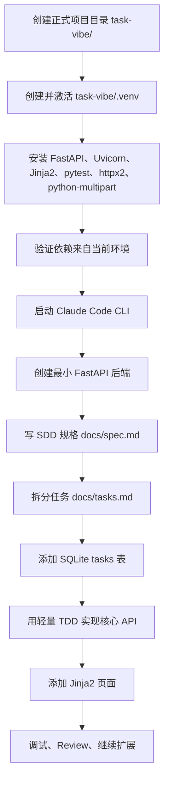

# 02. 创建正式项目目录并准备 Python 环境

## 预计用时

20-30 分钟。

## 本节位置

约 4 小时核心路线（00-10）的第 2 个学习单元。从这一节开始，我们正式进入全栈项目 `task-vibe/`。后续所有 FastAPI、SQLite、Jinja2、API 测试、页面调试和项目复盘，都会围绕这个目录展开。

请先记住一个非常重要的边界：`01` 里的 `.venv` 在 `vibecoding-method-lab/.venv`，它只服务于小函数 TDD 方法实验；本节要创建新的 `.venv`，位置是 `task-vibe/.venv`，它服务于正式 FastAPI 全栈项目。两个虚拟环境不是同一个，不能混用。不要因为 `01` 已经创建过 `.venv`，就跳过本节的环境准备。

本节还会调整一个关键顺序：先创建并激活 `task-vibe/.venv`，再安装依赖，确认环境正确后，最后启动 `Claude Code CLI`。这样 Claude 进入项目时，目录和 Python 环境都已经准备好，不会一开始就围绕错误环境生成建议。

## 工具使用规则

终端用于创建 `task-vibe/`、创建并激活 `task-vibe/.venv`、安装依赖、运行 `uvicorn`、执行 `curl`、检查 `main.py`。`Claude Code CLI` 只在环境准备完成后使用，用来按明确提示创建最小 `main.py` 并解释代码。

## 学习目标

完成本节后，你应该能做到 5 件事：

1. 创建正式项目目录 `task-vibe/`，并确认自己不在 `vibecoding-method-lab/`。
2. 在 `task-vibe/` 内创建独立虚拟环境 `task-vibe/.venv`。
3. 在当前虚拟环境中安装 `fastapi`、`uvicorn`、`jinja2`、`pytest`、`httpx2`、`python-multipart`。
4. 在正确目录和正确环境中启动 `Claude Code CLI`。
5. 创建并运行一个最小 FastAPI 服务，看到精确返回：`{"message":"Task Vibe is running"}`。

这节课的重点不是写很多代码，而是建立正式项目的“起跑线”。如果起跑线错了，后面所有步骤都会被影响。目录错了，文件会散落到错误位置；环境错了，依赖可能装到全局 Python；Claude 启动位置错了，它看到的上下文也会错。

## 三个身份提醒

- 产品负责人：决定正式项目从 `task-vibe/` 重新开始，不复用 `01` 的实验目录或虚拟环境。
- 测试者：用 `pwd`、依赖检查、`uvicorn` 日志和 `curl` 返回值确认项目起跑线真的正确。
- 学习者：能解释为什么要先准备目录和 `.venv`，再启动 `Claude Code CLI` 创建最小服务。

## 本节产出物

1. 一个正式项目目录：`task-vibe/`。
2. 一个正式项目虚拟环境：`task-vibe/.venv`。
3. 已安装的项目依赖：`fastapi`、`uvicorn`、`jinja2`、`pytest`、`httpx2`、`python-multipart`。
4. 一个最小 FastAPI 文件：`main.py`。
5. 一个能通过 `curl` 验证的本地服务。
6. 一张你能看懂的完整实践流程图。

## 操作步骤



### 第 1 步：创建正式项目目录

先创建 `task-vibe/`，并进入这个目录：

```bash
mkdir task-vibe
cd task-vibe
```

确认当前位置：

```bash
pwd
```

预期输出应该以 `task-vibe` 结尾。如果输出里还是 `vibecoding-method-lab`，说明你还停留在 `01` 的方法实验目录。请先切换到正确目录，再继续本节。

### 第 2 步：创建并激活正式项目虚拟环境

在 `task-vibe/` 目录里创建新的 `.venv`：

```bash
python -m venv .venv
source .venv/bin/activate
```

这一节的 `.venv` 和 `01` 的 `.venv` 不同。`01` 的环境路径是：

```text
vibecoding-method-lab/.venv
```

本节的环境路径是：

```text
task-vibe/.venv
```

它们分别属于不同目录、不同练习、不同目标。`vibecoding-method-lab/.venv` 只需要 `pytest`，因为它只跑小函数测试；`task-vibe/.venv` 需要 `fastapi`、`uvicorn`、`jinja2`、`pytest`、`httpx2`、`python-multipart`，因为它要支撑一个最小全栈项目、后续 `TestClient` 接口测试，以及表单提交场景。

### 第 3 步：安装正式项目依赖

确认虚拟环境已经激活后，安装依赖：

```bash
pip install fastapi uvicorn jinja2 pytest httpx2 python-multipart
```

这里每个依赖都有作用。`FastAPI` 用来写后端应用和路由；`uvicorn` 用来启动本地开发服务；`Jinja2` 用来渲染后面的 HTML 页面；`pytest` 用来支撑后续轻量 TDD；`httpx2` 用来支撑 `fastapi.testclient.TestClient` 背后的 HTTP 测试客户端；`python-multipart` 用来支撑后面基于表单的提交数据解析。如果缺少它，做到页面表单章节时，可能看到与 `multipart/form-data` 相关的依赖报错。

### 第 4 步：确认依赖来自当前环境

安装完成后，不要急着启动 Claude。先确认依赖能被当前 Python 环境找到：

```bash
python -m pip show fastapi pytest httpx2 python-multipart
```

预期输出会包含 `Name: fastapi`、`Name: pytest`、`Name: httpx2` 和 `Name: python-multipart`。如果没有看到这些信息，通常说明你没有激活 `task-vibe/.venv`，或者依赖装到了其他 Python 环境里。

这一步是新人很容易忽略的检查。很多“代码明明对但运行不了”的问题，其实不是代码问题，而是环境问题。先把环境确认好，后面和 Claude 协作时会少很多误判。

### 第 5 步：启动 Claude Code CLI

环境准备好之后，再在 `task-vibe/` 目录内启动 `Claude Code CLI`：

```bash
claude
```

如果你的本机 Claude Code CLI 入口命令不是 `claude`，请使用自己的启动方式。关键是：必须在 `task-vibe/` 目录里启动，而且启动前已经完成 `.venv` 和依赖准备。

启动后，先不要让 Claude 生成完整系统。请先让它确认当前项目状态，并只协助创建最小 FastAPI 骨架。

Claude Code 提示词示例：

```text
我们现在在 task-vibe 正式项目目录里。这个目录和上一节的 vibecoding-method-lab 不同。当前已经创建并激活 task-vibe/.venv，并安装 fastapi、uvicorn、jinja2、pytest、httpx2、python-multipart。请作为我的 Python 全栈练习搭档，先不要生成完整项目，只帮我确认当前环境适合开始 FastAPI + SQLite + Jinja2 的最小任务管理系统练习，并指导我创建最小 main.py。
```

这个提示词有两个边界：第一，它告诉 Claude 当前目录和环境已经准备好；第二，它明确要求不要生成完整项目。我们只要最小 FastAPI 骨架，不要登录、Docker、React、部署，也不要提前写 `docs/spec.md`。`SDD` 规格会在 `03` 单独完成。

### 第 6 步：让 Claude 创建最小 FastAPI 服务

现在已经在 `task-vibe/` 目录内启动了 `Claude Code CLI`，而且 `.venv` 和依赖都已经准备好。接下来使用 Claude 创建 `main.py`，不要让它生成完整项目。

Claude Code 提示词示例：

```text
请在当前 task-vibe/ 目录下创建一个最小 FastAPI 应用文件 main.py。要求：
1. 只创建 main.py；
2. 不创建数据库；
3. 不创建 templates；
4. 不生成完整项目结构；
5. 首页 GET / 返回 {"message": "Task Vibe is running"}。
创建后请解释 main.py 每一行代码的作用。
```
完成后检查：

```bash
ls
cat main.py
```

你应该看到当前目录里出现 `main.py`。检查本地文件并决定：它只需要满足本节最小 FastAPI 服务目标，不要求和下面参考修改示例完全一致。

参考修改示例：

```python
from fastapi import FastAPI

app = FastAPI()

@app.get("/")
def read_root():
    return {"message": "Task Vibe is running"}
```

确认文件内容正确后，激活同一个 `task-vibe/.venv`。

```bash
cd task-vibe
source .venv/bin/activate
python -m pip show uvicorn fastapi httpx2 python-multipart
python -m uvicorn main:app --reload
```

服务启动后，让这个终端保持运行。再打开另一个终端窗口执行验证。`curl` 本身不依赖 Python venv，但这里仍然激活同一个环境，可以让上下文保持一致，后续调试更清楚：

```bash
cd task-vibe
source .venv/bin/activate
curl http://127.0.0.1:8000/
```

如果输出是 `{"message":"Task Vibe is running"}`，说明正式项目的最小后端入口已经跑通。

## 输入输出对照

| 输入 | 预期输出 | 学生要比较什么 |
|---|---|---|
| `pwd` | 当前目录以 `task-vibe` 结尾 | 是否真的离开了 `vibecoding-method-lab/`，进入正式项目目录。 |
| `python -m venv .venv` | 当前目录出现 `task-vibe/.venv` | 是否为正式项目创建了独立环境，而不是复用 `01` 的环境。 |
| `pip install fastapi uvicorn jinja2 pytest httpx2 python-multipart` | 依赖安装完成，没有明显报错 | 是否把正式项目依赖装进当前环境。 |
| `python -m pip show fastapi pytest httpx2 python-multipart` | 能看到 `Name: fastapi`、`Name: pytest`、`Name: httpx2` 和 `Name: python-multipart` | 是否能证明依赖来自当前 Python 环境。 |
| `claude` | 在 `task-vibe/` 内启动 `Claude Code CLI` | 是否在正确目录、正确环境准备完成后再启动 Claude。 |
| Claude 创建 `main.py` | 当前目录出现 `main.py`，且只包含最小 FastAPI 应用 | 是否让 Claude 聚焦创建单个文件，而不是生成完整项目。 |
| `cat main.py` | 能看到 `GET /` 返回 `{"message": "Task Vibe is running"}` | 是否回到终端检查了 Claude 的产物。 |
| 退出 Claude 后重新激活 `.venv` | `python -m pip show uvicorn fastapi httpx2 python-multipart` 能显示包信息 | 是否已经回到普通终端，并确认当前环境可用。 |
| `python -m uvicorn main:app --reload` | 服务启动并监听本地端口 | 是否使用当前虚拟环境里的 `uvicorn` 启动服务。 |
| `curl http://127.0.0.1:8000/` | `{"message":"Task Vibe is running"}` | 最小 FastAPI 服务是否真的可访问。 |

## 验收标准

运行或检查：

```bash
pwd
python -m pip show fastapi pytest httpx2 python-multipart
python -m uvicorn main:app --reload
curl http://127.0.0.1:8000/
```

通过标准：

- 当前目录是 `task-vibe/`，不是 `vibecoding-method-lab/`。
- 当前虚拟环境是 `task-vibe/.venv`，不是 `vibecoding-method-lab/.venv`。
- 你已经创建并激活 `task-vibe/.venv`。
- 你已经安装 `fastapi`、`uvicorn`、`jinja2`、`pytest`、`httpx2`、`python-multipart`。
- `python -m pip show fastapi pytest httpx2 python-multipart` 能显示包信息。
- 你是在环境准备完成后才启动 `Claude Code CLI`。
- Claude 创建 `main.py` 后，你已经回到普通终端，并重新激活了 `task-vibe/.venv`。
- 你使用 `python -m uvicorn main:app --reload` 启动服务，而不是依赖全局 `uvicorn`。
- `curl` 返回精确 JSON：`{"message":"Task Vibe is running"}`。
- 你知道下一节 `03` 才开始正式写 `SDD` 项目规格。

需要停下处理：

- 如果你还在 `vibecoding-method-lab/` 里继续做正式项目，先切回正确目录。
- 如果你复用了 `01` 的 `.venv`，或者依赖装到了全局 Python，先重新建立本节环境。
- 如果你先启动 Claude，后来才发现 Python 环境没有准备好，先把环境补完整再继续。
- 如果服务启动失败，或者 `curl` 返回 404、500、连接失败，先不要进入下一节；把当前命令、完整报错、`main.py` 内容发给 `Claude Code CLI`，只解决本节问题。

## 常见卡点

- 误以为 `01` 已经创建过 `.venv`，所以 `02` 不需要再创建。实际上 `01` 的环境只属于小函数实验，`02` 必须有自己的正式项目环境。
- 忘记先 `cd task-vibe` 就创建 `.venv`，导致虚拟环境出现在错误目录。
- 激活了错误目录下的 `.venv`，例如仍然激活 `vibecoding-method-lab/.venv`。
- 依赖安装到了全局 Python，而不是 `task-vibe/.venv`。
- 先启动 Claude，再让它帮你处理环境问题，导致对话一开始就被错误上下文污染。
- Claude 创建 `main.py` 后，没有退出 Claude 或新开终端，就把 shell 命令输进 Claude 交互界面。
- 新开终端后忘记重新 `cd task-vibe` 和 `source .venv/bin/activate`。
- 使用裸 `uvicorn main:app --reload`，结果调用到全局环境里的 `uvicorn`。
- `uvicorn` 服务已经启动，但在同一个终端里继续输入 `curl`。应该另开一个终端执行 `curl`。
- 端口不是 `8000`，或者服务没有启动成功，就直接访问接口。
